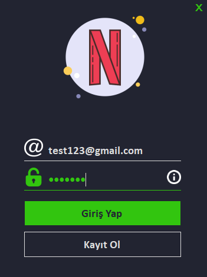
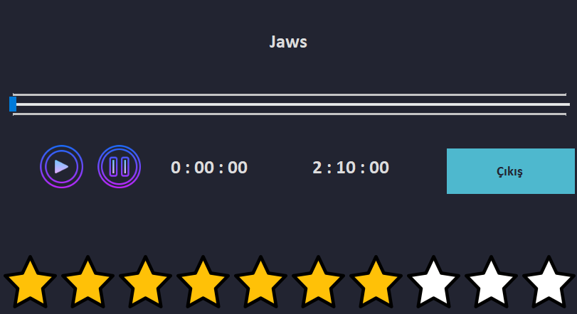

# Netflix Desktop App

This repository include 3rd project of 'Programming Lab-2' at Computer Engineering Kocaeli University

## Abstract

The purpose of this project is to understand the structure of database management systems and to provide solutions for these systems. 
Programs monitoring platform has been developed. Users can log in and login. The relations between the users and the programs they watch are kept in the database. 
The project has been developed using the ms access database management system and the C# programming language. The graphic part has been done using the Windows Forms.

## İnterface

* 
---
* 
---
* 
---
* 
---
* 
---
* 

## Developers

* [Mahmut ÖZ](https://github.com/mahmutoz)
* [Ömer Gürbüz](https://github.com/ZeyMer1309)
